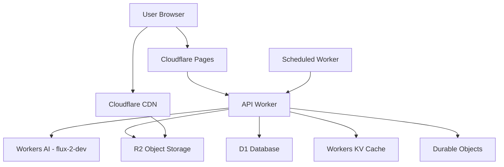

# Design Document

## Overview

The Bible Image Generator is a serverless application built entirely on Cloudflare's edge infrastructure. It leverages Workers AI (flux-2-dev model) to generate inspirational images based on biblical verses, with seamless WhatsApp sharing capabilities. The architecture prioritizes cost-effectiveness, scalability, and performance by utilizing Cloudflare's free tier offerings: Workers for compute, R2 for object storage, D1 for relational data, Workers KV for caching, and Pages for frontend hosting.

The system follows a request-response pattern for on-demand generation and a scheduled pattern for daily verse automation. All components run at the edge, minimizing latency and maximizing cache hit rates.

## Architecture

### High-Level Architecture



### Component Layers

1. **Presentation Layer**: Cloudflare Pages serving a responsive SPA
2. **API Layer**: Cloudflare Workers handling REST endpoints
3. **AI Layer**: Workers AI running flux-2-dev for image generation
4. **Storage Layer**: R2 for images, D1 for metadata, KV for cache
5. **Coordination Layer**: Durable Objects for rate limiting and job coordination
6. **Automation Layer**: Scheduled Workers for daily verse generation and cleanup

### Request Flow

**On-Demand Generation:**
1. User submits verse reference + style preferences via frontend
2. Pages Function or Worker receives POST request
3. Worker validates input and checks rate limits (Durable Object)
4. Worker queries D1 for verse text or uses embedded verse data
5. Worker constructs prompt and calls Workers AI (flux-2-dev)
6. Worker receives generated image bytes
7. Worker stores image in R2 with unique key
8. Worker saves metadata to D1
9. Worker returns image URL and WhatsApp share link
10. Frontend displays image with share buttons

**Daily Verse Generation:**
1. Scheduled Worker triggers at configured time (e.g., 6 AM UTC)
2. Worker selects verse from rotation list in D1
3. Worker generates image using predefined style template
4. Worker stores with "daily-verse" tag
5. Worker updates KV cache with latest daily verse ID
6. Users accessing homepage see cached daily verse

## Components and Interfaces

### 1. API Worker (`src/worker.ts`)

Main entry point for all API requests.

**Endpoints:**

```typescript
POST /api/generate
  Request: {
    verseReference: string;      // e.g., "John 3:16"
    verseText?: string;           // Optional override
    stylePreset?: string;         // "modern" | "classic" | "minimalist"
    customPrompt?: string;        // Additional prompt guidance
    requestId?: string;           // For idempotency
  }
  Response: {
    imageId: string;
    imageUrl: string;
    whatsappShareUrl: string;
    verseReference: string;
    verseText: string;
  }

GET /api/images/:imageId
  Response: {
    imageId: string;
    imageUrl: string;
    metadata: ImageMetadata;
  }

GET /api/daily-verse
  Response: {
    imageId: string;
    imageUrl: string;
    verseReference: string;
    verseText: string;
    generatedAt: string;
  }

GET /api/images/:imageId/share
  Response: Redirect to WhatsApp share URL

POST /api/admin/moderate
  Request: {
    imageId: string;
    action: "approve" | "reject";
    reason?: string;
  }
  Response: { success: boolean }
```

**Key Responsibilities:**
- Request validation and sanitization
- Rate limit enforcement via Durable Objects
- Orchestration of generation pipeline
- Error handling and logging
- CORS policy enforcement

### 2. Image Generation Service (`src/services/imageGenerator.ts`)

Handles AI model interaction and prompt engineering.

**Interface:**

```typescript
interface ImageGenerationService {
  generate(params: GenerationParams): Promise<GeneratedImage>;
  constructPrompt(verse: Verse, style: StylePreset): string;
  validatePrompt(prompt: string): ValidationResult;
}

interface GenerationParams {
  prompt: string;
  seed?: number;
  width?: number;
  height?: number;
  steps?: number;
}

interface GeneratedImage {
  imageData: ArrayBuffer;
  format: string;
  metadata: {
    model: string;
    seed: number;
    dimensions: { width: number; height: number };
  };
}
```

**Prompt Construction Strategy:**
- Base template: "Inspirational biblical scene, [verse theme], [style adjectives], high quality, detailed"
- Style presets inject specific artistic directions
- Verse text is analyzed for key themes (love, hope, strength, etc.)
- Negative prompts filter out unwanted elements

### 3. Storage Service (`src/services/storage.ts`)

Manages R2 and D1 operations.

**Interface:**

```typescript
interface StorageService {
  saveImage(image: ArrayBuffer, metadata: ImageMetadata): Promise<string>;
  getImage(imageId: string): Promise<ArrayBuffer>;
  getImageUrl(imageId: string, signed?: boolean): Promise<string>;
  saveMetadata(metadata: ImageMetadata): Promise<void>;
  getMetadata(imageId: string): Promise<ImageMetadata>;
  deleteImage(imageId: string): Promise<void>;
}

interface ImageMetadata {
  imageId: string;
  userId?: string;
  verseReference: string;
  verseText: string;
  prompt: string;
  stylePreset: string;
  generatedAt: string;
  tags: string[];
  moderationStatus: "pending" | "approved" | "rejected";
}
```

**Storage Strategy:**
- Image keys: `images/{year}/{month}/{imageId}.webp`
- Metadata stored in D1 `images` table
- Public images served via R2 public bucket
- Private images use signed URLs with 1-hour expiration

### 4. Rate Limiter (Durable Object) (`src/durableObjects/rateLimiter.ts`)

Tracks and enforces rate limits per user/IP.

**Interface:**

```typescript
class RateLimiter {
  async checkLimit(identifier: string, tier: "anonymous" | "authenticated"): Promise<RateLimitResult>;
  async recordRequest(identifier: string): Promise<void>;
  async resetLimit(identifier: string): Promise<void>;
}

interface RateLimitResult {
  allowed: boolean;
  remaining: number;
  resetAt: number;
}
```

**Rate Limit Tiers:**
- Anonymous: 5 requests per hour
- Authenticated: 20 requests per hour
- Daily verse generation: unlimited (internal)

### 5. Verse Service (`src/services/verseService.ts`)

Manages verse data and selection.

**Interface:**

```typescript
interface VerseService {
  getVerse(reference: string): Promise<Verse>;
  getDailyVerse(): Promise<Verse>;
  searchVerses(query: string): Promise<Verse[]>;
}

interface Verse {
  reference: string;
  text: string;
  book: string;
  chapter: number;
  verse: number;
  translation: string;
}
```

**Data Source:**
- Embedded JSON file with popular verses for MVP
- Future: External Bible API integration
- D1 table for curated daily verse rotation

### 6. Share Service (`src/services/shareService.ts`)

Generates share links for various platforms.

**Interface:**

```typescript
interface ShareService {
  generateWhatsAppLink(imageUrl: string, verse: Verse): string;
  generateWebShareData(imageUrl: string, verse: Verse): ShareData;
}
```

**WhatsApp Link Format:**
```
https://wa.me/?text={encodedMessage}
Message: "{verseText}" - {verseReference}\n{imageUrl}
```

### 7. Scheduled Worker (`src/scheduled.ts`)

Handles cron-triggered tasks.

**Tasks:**
- Daily verse generation (6 AM UTC)
- Image cleanup (weekly, Sunday 2 AM UTC)
- D1 backup to R2 (daily, 3 AM UTC)
- Usage metrics aggregation (daily, midnight UTC)

### 8. Frontend Application (`frontend/`)

React-based SPA hosted on Cloudflare Pages.

**Key Components:**
- `GeneratorForm`: Input for verse reference and style
- `ImageDisplay`: Shows generated image with download/share buttons
- `DailyVerse`: Homepage component displaying daily verse
- `Gallery`: User's generation history
- `ShareModal`: WhatsApp and social sharing options

**State Management:**
- React Context for global state
- Local storage for user preferences
- Service worker for offline support (future)

## Data Models

### D1 Database Schema

```sql
-- Images table
CREATE TABLE images (
  id TEXT PRIMARY KEY,
  user_id TEXT,
  verse_reference TEXT NOT NULL,
  verse_text TEXT NOT NULL,
  prompt TEXT NOT NULL,
  style_preset TEXT NOT NULL,
  r2_key TEXT NOT NULL,
  file_size INTEGER,
  format TEXT DEFAULT 'webp',
  width INTEGER,
  height INTEGER,
  tags TEXT, -- JSON array
  moderation_status TEXT DEFAULT 'approved',
  generated_at DATETIME DEFAULT CURRENT_TIMESTAMP,
  created_at DATETIME DEFAULT CURRENT_TIMESTAMP
);

CREATE INDEX idx_images_user_id ON images(user_id);
CREATE INDEX idx_images_verse_ref ON images(verse_reference);
CREATE INDEX idx_images_tags ON images(tags);
CREATE INDEX idx_images_generated_at ON images(generated_at);

-- Verses table (for daily rotation)
CREATE TABLE verses (
  id INTEGER PRIMARY KEY AUTOINCREMENT,
  reference TEXT UNIQUE NOT NULL,
  text TEXT NOT NULL,
  book TEXT NOT NULL,
  chapter INTEGER NOT NULL,
  verse INTEGER NOT NULL,
  translation TEXT DEFAULT 'NIV',
  theme TEXT, -- JSON array
  last_used DATETIME,
  use_count INTEGER DEFAULT 0
);

CREATE INDEX idx_verses_last_used ON verses(last_used);

-- Users table (optional, for future auth)
CREATE TABLE users (
  id TEXT PRIMARY KEY,
  email TEXT UNIQUE,
  created_at DATETIME DEFAULT CURRENT_TIMESTAMP,
  tier TEXT DEFAULT 'free'
);

-- Moderation queue
CREATE TABLE moderation_queue (
  id INTEGER PRIMARY KEY AUTOINCREMENT,
  image_id TEXT NOT NULL,
  flagged_reason TEXT,
  flagged_at DATETIME DEFAULT CURRENT_TIMESTAMP,
  reviewed_at DATETIME,
  reviewer_id TEXT,
  decision TEXT,
  FOREIGN KEY (image_id) REFERENCES images(id)
);

-- Usage metrics
CREATE TABLE usage_metrics (
  id INTEGER PRIMARY KEY AUTOINCREMENT,
  date DATE NOT NULL,
  total_generations INTEGER DEFAULT 0,
  successful_generations INTEGER DEFAULT 0,
  failed_generations INTEGER DEFAULT 0,
  total_storage_bytes INTEGER DEFAULT 0,
  unique_users INTEGER DEFAULT 0
);

CREATE UNIQUE INDEX idx_metrics_date ON usage_metrics(date);
```

### Workers KV Namespaces

```typescript
// KV_CACHE namespace
{
  "daily-verse:current": string,           // Current daily verse image ID
  "verse:{reference}": string,             // Cached verse text
  "config:rate-limits": string,            // Rate limit configuration
  "config:style-presets": string,          // Style preset definitions
  "config:moderation-blocklist": string,   // Blocked terms list
}

// KV_SESSIONS namespace (future)
{
  "session:{sessionId}": string,           // User session data
}
```

### R2 Bucket Structure

```
bible-images/
├── images/
│   ├── 2025/
│   │   ├── 01/
│   │   │   ├── {uuid}.webp
│   │   │   └── {uuid}.webp
│   │   └── 02/
│   └── 2024/
├── backups/
│   ├── d1-backup-2025-01-15.sql
│   └── d1-backup-2025-01-14.sql
└── temp/
    └── {processing-id}.tmp
```

## Correctness Properties

*A property is a characteristic or behavior that should hold true across all valid executions of a system—essentially, a formal statement about what the system should do. Properties serve as the bridge between human-readable specifications and machine-verifiable correctness guarantees.*


### Property 1: Prompt construction completeness
*For any* verse reference and style preset, the constructed prompt should contain both the verse theme/text and the style parameters.
**Validates: Requirements 1.1**

### Property 2: AI service invocation
*For any* valid prompt, the system should successfully invoke Workers AI with the flux-2-dev model and receive a response.
**Validates: Requirements 1.2**

### Property 3: Generation timeout compliance
*For any* successful image generation, the operation should complete within 30 seconds.
**Validates: Requirements 1.3**

### Property 4: Error handling completeness
*For any* generation failure, the system should return an error message and create a log entry with failure details.
**Validates: Requirements 1.4**

### Property 5: Input sanitization
*For any* prompt containing terms from the blocklist, the sanitizer should either remove the terms or reject the prompt entirely.
**Validates: Requirements 1.5**

### Property 6: Storage persistence
*For any* successfully generated image, storing it in R2 and then retrieving it by ID should return the same image data.
**Validates: Requirements 2.1, 2.4**

### Property 7: Filename uniqueness
*For any* two different generation requests (different user, timestamp, or parameters), the generated filenames should be distinct.
**Validates: Requirements 2.2**

### Property 8: Metadata completeness
*For any* stored image, querying its metadata should return all required fields: verse reference, generation timestamp, user identifier, and prompt parameters.
**Validates: Requirements 2.3**

### Property 9: Cache consistency
*For any* metadata record, after the first retrieval from D1, subsequent requests within the cache TTL should return the same data from KV cache.
**Validates: Requirements 2.5**

### Property 10: URL generation
*For any* generated image, the system should produce a valid, accessible public URL.
**Validates: Requirements 3.1**

### Property 11: WhatsApp link format
*For any* image URL and verse text, the generated WhatsApp share link should follow the wa.me format and include both the encoded verse text and image URL.
**Validates: Requirements 3.2**

### Property 12: Signed URL validity
*For any* private image request, the generated signed URL should include a valid signature and expiration timestamp, and should be accessible before expiration.
**Validates: Requirements 3.5**

### Property 13: Daily verse selection
*For any* daily generation run, a verse should be selected from the database, and that verse's last_used timestamp should be updated.
**Validates: Requirements 4.2**

### Property 14: Daily verse styling
*For any* daily verse generation, the image should be created using the predefined daily style parameters.
**Validates: Requirements 4.3**

### Property 15: Daily verse tagging
*For any* daily verse generation, the stored metadata should include the "daily-verse" tag.
**Validates: Requirements 4.4**

### Property 16: Rate limit enforcement
*For any* user making requests beyond their tier limit within the time window, subsequent requests should be rejected with 429 status.
**Validates: Requirements 5.1, 5.2**

### Property 17: Tier-based rate limits
*For any* anonymous user and authenticated user making requests, the anonymous user should have a lower rate limit threshold.
**Validates: Requirements 5.3**

### Property 18: Progressive rate limiting
*For any* user exhibiting suspicious patterns (e.g., rapid bursts), the system should apply progressively stricter limits.
**Validates: Requirements 5.4**

### Property 19: CAPTCHA enforcement
*For any* user exceeding the high-frequency threshold when Turnstile is enabled, subsequent requests should require CAPTCHA verification.
**Validates: Requirements 5.5**

### Property 20: Cache headers presence
*For any* image served from R2, the response should include Cache-Control headers with appropriate max-age values.
**Validates: Requirements 6.1**

### Property 21: Cache-first metadata retrieval
*For any* frequently accessed metadata, the second and subsequent requests should be served from KV cache faster than the first D1 query.
**Validates: Requirements 6.2**

### Property 22: WebP format selection
*For any* image storage operation where the client supports WebP, the stored image format should be WebP.
**Validates: Requirements 6.4**

### Property 23: Blocklist validation
*For any* prompt containing one or more terms from the moderation blocklist, the validation should fail.
**Validates: Requirements 7.1, 7.2**

### Property 24: Content safety enforcement
*For any* generated image that fails content safety checks (when enabled), the image should not be stored in R2 and no metadata record should be created.
**Validates: Requirements 7.3, 7.4**

### Property 25: Moderation queue creation
*For any* content flagged for manual review, a record should be created in the moderation_queue table with the image ID and flagged reason.
**Validates: Requirements 7.5**

### Property 26: CORS policy enforcement
*For any* cross-origin request from a non-allowed origin, the response should include CORS headers that reject the request.
**Validates: Requirements 8.2**

### Property 27: Authentication validation
*For any* request to a protected endpoint without valid authentication, the system should return a 401 or 403 status code.
**Validates: Requirements 8.3**

### Property 28: Error logging completeness
*For any* error that occurs during request processing, a log entry should be created containing the error message, stack trace, and request context.
**Validates: Requirements 9.1**

### Property 29: Metrics recording
*For any* generation request (successful or failed), metrics should be recorded including the request timestamp, outcome, and latency.
**Validates: Requirements 9.2**

### Property 30: Usage tracking
*For any* R2 write operation or D1 query, the system should increment the corresponding usage counter for cost estimation.
**Validates: Requirements 9.3**

### Property 31: Rate limit event logging
*For any* rate limit rejection, a log entry should be created with the user identifier, timestamp, and limit tier.
**Validates: Requirements 9.4**

### Property 32: Quota alerting
*For any* usage metric that exceeds 80% of the defined quota, an alert should be generated and sent to administrators.
**Validates: Requirements 9.5**

### Property 33: Age-based cleanup identification
*For any* image older than the retention threshold (excluding protected images), the cleanup process should identify it for deletion.
**Validates: Requirements 10.1**

### Property 34: Cleanup consistency
*For any* image deleted during cleanup, both the R2 object and the D1 metadata record should be removed.
**Validates: Requirements 10.2**

### Property 35: Protected image exemption
*For any* image tagged as "favorite" or "daily-verse", it should not be deleted during cleanup regardless of age.
**Validates: Requirements 10.3**

### Property 36: Backup before cleanup
*For any* cleanup operation, a D1 backup should be created and stored in R2 before any deletions occur.
**Validates: Requirements 10.4**

### Property 37: Backup retention
*For any* backup created, it should remain in R2 for the defined retention period before being eligible for deletion.
**Validates: Requirements 10.5**

### Property 38: Idempotency with request ID
*For any* generation request with a request ID, making the same request multiple times should return the same image ID and URL without regenerating.
**Validates: Requirements 12.1, 12.2**

### Property 39: Deterministic naming
*For any* two requests with identical parameters (verse, style, user), the generated filename should be identical.
**Validates: Requirements 12.3**

### Property 40: Retry safety
*For any* failed request that is retried, the system should not create duplicate resources or inconsistent state.
**Validates: Requirements 12.4**

### Property 41: Concurrency safety
*For any* set of concurrent requests to the same Durable Object, the final state should be consistent and race-condition-free.
**Validates: Requirements 12.5**

## Error Handling

### Error Categories

1. **Validation Errors (400)**
   - Invalid verse reference format
   - Missing required fields
   - Prompt contains blocked content
   - Invalid style preset

2. **Authentication Errors (401/403)**
   - Missing or invalid JWT token
   - Insufficient permissions for protected routes

3. **Rate Limit Errors (429)**
   - User exceeded request quota
   - Include Retry-After header with reset time

4. **AI Service Errors (502/503)**
   - Workers AI timeout or unavailable
   - Model inference failure
   - Implement exponential backoff retry (max 3 attempts)

5. **Storage Errors (500)**
   - R2 write/read failure
   - D1 query failure
   - KV operation failure
   - Implement transaction rollback where possible

6. **Content Moderation Errors (451)**
   - Content flagged by safety checks
   - Prompt rejected by moderation

### Error Response Format

```typescript
interface ErrorResponse {
  error: {
    code: string;           // Machine-readable error code
    message: string;        // Human-readable message
    details?: any;          // Additional context (dev mode only)
    requestId: string;      // For support tracking
    retryAfter?: number;    // For rate limits
  };
}
```

### Retry Strategy

- **Transient failures**: Exponential backoff (1s, 2s, 4s)
- **Rate limits**: Wait for Retry-After duration
- **Permanent failures**: No retry, return error immediately
- **Idempotency**: Use request IDs to prevent duplicate processing

### Logging Strategy

```typescript
interface LogEntry {
  timestamp: string;
  level: "debug" | "info" | "warn" | "error";
  requestId: string;
  userId?: string;
  operation: string;
  duration?: number;
  error?: {
    message: string;
    stack: string;
    code: string;
  };
  metadata?: Record<string, any>;
}
```

## Testing Strategy

### Unit Testing

**Framework**: Vitest (for TypeScript/JavaScript)

**Coverage Areas:**
- Prompt construction logic
- Input sanitization and validation
- URL generation (WhatsApp links, signed URLs)
- Filename generation and uniqueness
- Error response formatting
- Metadata serialization/deserialization

**Example Unit Tests:**
```typescript
describe("PromptConstructor", () => {
  test("combines verse and style correctly", () => {
    const verse = { reference: "John 3:16", text: "For God so loved..." };
    const style = "modern";
    const prompt = constructPrompt(verse, style);
    expect(prompt).toContain("For God so loved");
    expect(prompt).toContain("modern");
  });

  test("sanitizes blocked terms", () => {
    const input = "Create an image with inappropriate content";
    const sanitized = sanitizePrompt(input);
    expect(sanitized).not.toContain("inappropriate");
  });
});
```

### Property-Based Testing

**Framework**: fast-check (JavaScript property-based testing library)

**Configuration:**
- Minimum 100 iterations per property test
- Use seed for reproducibility
- Generate edge cases automatically

**Property Test Implementation:**

Each property-based test MUST be tagged with a comment referencing the design document property:

```typescript
import fc from "fast-check";

/**
 * Feature: bible-image-generator, Property 7: Filename uniqueness
 */
test("different requests generate unique filenames", () => {
  fc.assert(
    fc.property(
      fc.record({
        userId: fc.uuid(),
        timestamp: fc.date(),
        verseRef: fc.string(),
      }),
      fc.record({
        userId: fc.uuid(),
        timestamp: fc.date(),
        verseRef: fc.string(),
      }),
      (req1, req2) => {
        fc.pre(JSON.stringify(req1) !== JSON.stringify(req2));
        const filename1 = generateFilename(req1);
        const filename2 = generateFilename(req2);
        expect(filename1).not.toBe(filename2);
      }
    ),
    { numRuns: 100 }
  );
});

/**
 * Feature: bible-image-generator, Property 6: Storage persistence
 */
test("stored images can be retrieved", async () => {
  fc.assert(
    fc.asyncProperty(
      fc.uint8Array({ minLength: 100, maxLength: 1000 }),
      fc.record({
        verseReference: fc.string(),
        userId: fc.uuid(),
      }),
      async (imageData, metadata) => {
        const imageId = await storage.saveImage(imageData, metadata);
        const retrieved = await storage.getImage(imageId);
        expect(retrieved).toEqual(imageData);
      }
    ),
    { numRuns: 100 }
  );
});

/**
 * Feature: bible-image-generator, Property 38: Idempotency with request ID
 */
test("duplicate requests return same result", async () => {
  fc.assert(
    fc.asyncProperty(
      fc.record({
        requestId: fc.uuid(),
        verseReference: fc.string(),
        style: fc.constantFrom("modern", "classic", "minimalist"),
      }),
      async (request) => {
        const result1 = await generateImage(request);
        const result2 = await generateImage(request);
        expect(result1.imageId).toBe(result2.imageId);
        expect(result1.imageUrl).toBe(result2.imageUrl);
      }
    ),
    { numRuns: 100 }
  );
});
```

**Generators for Domain Objects:**

```typescript
// Custom generators for domain-specific data
const verseReferenceArb = fc.record({
  book: fc.constantFrom("Genesis", "John", "Psalms", "Romans"),
  chapter: fc.integer({ min: 1, max: 150 }),
  verse: fc.integer({ min: 1, max: 50 }),
}).map(({ book, chapter, verse }) => `${book} ${chapter}:${verse}`);

const stylePresetArb = fc.constantFrom("modern", "classic", "minimalist", "artistic");

const imageMetadataArb = fc.record({
  imageId: fc.uuid(),
  userId: fc.option(fc.uuid(), { nil: undefined }),
  verseReference: verseReferenceArb,
  verseText: fc.lorem({ maxCount: 50 }),
  prompt: fc.lorem({ maxCount: 100 }),
  stylePreset: stylePresetArb,
  generatedAt: fc.date().map(d => d.toISOString()),
  tags: fc.array(fc.string(), { maxLength: 5 }),
  moderationStatus: fc.constantFrom("pending", "approved", "rejected"),
});
```

### Integration Testing

**Test Scenarios:**
- End-to-end generation flow (API → AI → Storage → Response)
- Rate limiting with Durable Objects
- Cache behavior (KV → D1 fallback)
- Scheduled worker execution
- WhatsApp share link generation and validation

**Mocking Strategy:**
- Mock Workers AI responses for consistent testing
- Use Miniflare for local Workers environment
- Mock R2 with in-memory storage for tests
- Use D1 local database for integration tests

### Load Testing

**Tools**: k6 or Artillery

**Scenarios:**
- Concurrent generation requests (10, 50, 100 users)
- Rate limit threshold testing
- Cache hit rate measurement
- Durable Object coordination under load

## Deployment and Operations

### Environment Configuration

```typescript
interface Environment {
  // Bindings
  AI: Ai;                          // Workers AI binding
  R2_BUCKET: R2Bucket;             // R2 bucket binding
  DB: D1Database;                  // D1 database binding
  KV_CACHE: KVNamespace;           // KV namespace binding
  RATE_LIMITER: DurableObjectNamespace;  // Durable Object binding
  
  // Secrets
  JWT_SECRET: string;              // For authentication
  ADMIN_API_KEY: string;           // For admin endpoints
  
  // Environment variables
  ENVIRONMENT: "development" | "production";
  ALLOWED_ORIGINS: string;         // Comma-separated CORS origins
  RATE_LIMIT_ANONYMOUS: number;    // Requests per hour
  RATE_LIMIT_AUTHENTICATED: number;
  IMAGE_RETENTION_DAYS: number;
  BACKUP_RETENTION_DAYS: number;
  ENABLE_CONTENT_MODERATION: boolean;
}
```

### Deployment Process

1. **Development**:
   ```bash
   npm run dev              # Start local development with Miniflare
   npm run test             # Run unit and property tests
   npm run test:integration # Run integration tests
   ```

2. **Staging**:
   ```bash
   wrangler deploy --env staging
   wrangler d1 migrations apply DB --env staging
   ```

3. **Production**:
   ```bash
   npm run test:all         # Full test suite
   wrangler deploy --env production
   wrangler d1 migrations apply DB --env production
   ```

### Monitoring and Observability

**Metrics to Track:**
- Generation request rate (per minute/hour)
- Success/failure rate
- Average generation latency
- R2 storage usage (bytes)
- D1 query count and latency
- Cache hit rate (KV)
- Rate limit rejections
- Error rate by type

**Alerting Thresholds:**
- Error rate > 5% for 5 minutes
- Generation latency > 35 seconds (p95)
- Storage usage > 80% of quota
- Rate limit rejections > 100/hour (potential attack)

**Logging:**
- All errors with stack traces
- Rate limit events
- Content moderation flags
- Scheduled worker executions
- Backup operations

### Cost Estimation

**Free Tier Limits (Cloudflare):**
- Workers: 100,000 requests/day
- Workers AI: Limited free inference (check current quotas)
- R2: 10 GB storage, 1M Class A operations/month
- D1: 5 GB storage, 5M rows read/day
- Pages: Unlimited requests

**Estimated Costs (Beyond Free Tier):**
- Workers AI: ~$0.01 per image (flux-2-dev pricing)
- R2 storage: $0.015/GB/month
- R2 operations: $4.50 per million Class A operations
- D1: $0.75 per million rows read

**Example Monthly Cost (1000 images):**
- AI generation: $10
- R2 storage (1000 × 500KB): ~$0.01
- R2 operations: ~$0.01
- D1 queries: Free tier
- **Total: ~$10-15/month**

### Security Considerations

1. **Input Validation**: Sanitize all user inputs before processing
2. **Rate Limiting**: Prevent abuse and DoS attacks
3. **Content Moderation**: Block inappropriate content generation
4. **CORS**: Restrict API access to allowed origins
5. **Secrets Management**: Use Workers Secrets for sensitive data
6. **Signed URLs**: Protect private images with expiring signatures
7. **SQL Injection**: Use parameterized queries for D1
8. **XSS Prevention**: Sanitize outputs in frontend

### Backup and Recovery

**Backup Strategy:**
- Daily D1 snapshots to R2 (automated via Scheduled Worker)
- Retain backups for 30 days
- Images are primary data (no backup needed, can regenerate)

**Recovery Procedures:**
1. **D1 Database Corruption**:
   ```bash
   wrangler d1 restore DB --from-backup backup-2025-01-15.sql
   ```

2. **Accidental Image Deletion**:
   - Check D1 metadata for regeneration parameters
   - Regenerate image using stored prompt and seed

3. **Complete Service Outage**:
   - Redeploy Workers from Git
   - Restore D1 from latest backup
   - Verify R2 bucket accessibility

## Future Enhancements

1. **User Authentication**: Implement full user accounts with OAuth
2. **Image Editing**: Allow users to adjust generated images
3. **Batch Generation**: Generate multiple variations at once
4. **Social Media Integration**: Direct posting to Instagram, Facebook
5. **Custom Fonts**: Allow users to select typography for verse text
6. **Image Templates**: Pre-designed layouts for different occasions
7. **Analytics Dashboard**: User-facing stats on their generations
8. **API Access**: Public API for third-party integrations
9. **Mobile App**: Native iOS/Android apps
10. **Collaborative Collections**: Share and curate image collections

## Technology Stack Summary

- **Runtime**: Cloudflare Workers (V8 isolates)
- **AI Model**: Workers AI - flux-2-dev
- **Storage**: R2 (images), D1 (metadata), KV (cache)
- **Frontend**: React + TypeScript on Cloudflare Pages
- **Testing**: Vitest (unit), fast-check (property-based)
- **Deployment**: Wrangler CLI
- **Language**: TypeScript throughout
- **Build Tool**: Vite
- **Styling**: Tailwind CSS (for frontend)

## Conclusion

This design provides a comprehensive, cost-effective solution for generating and sharing biblical images using cutting-edge AI technology. By leveraging Cloudflare's serverless infrastructure, the system achieves global scale, low latency, and minimal operational overhead while staying within generous free tier limits for MVP deployment.

The architecture prioritizes correctness through property-based testing, security through defense-in-depth, and user experience through edge computing and intelligent caching. The modular design allows for incremental development and easy extension with future features.
