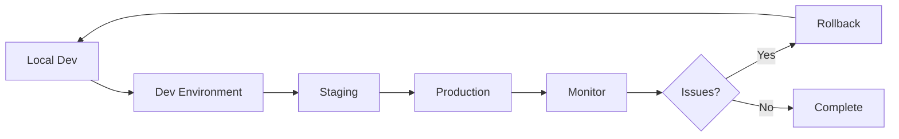

# Database Migration Guide

This guide covers creating, applying, and managing D1 database migrations for the Bible Image Generator.

## Table of Contents

1. [Overview](#overview)
2. [Migration Workflow](#migration-workflow)
3. [Creating Migrations](#creating-migrations)
4. [Applying Migrations](#applying-migrations)
5. [Testing Migrations](#testing-migrations)
6. [Rollback Strategies](#rollback-strategies)
7. [Best Practices](#best-practices)
8. [Common Scenarios](#common-scenarios)

## Overview

### What are Migrations?

Migrations are versioned SQL scripts that modify your database schema. They allow you to:
- Track database changes over time
- Apply changes consistently across environments
- Rollback changes if needed
- Collaborate with team members

### Migration Files

Migrations are stored in the `migrations/` directory:

```
migrations/
├── 0001_create_initial_schema.sql
├── 0002_seed_verses.sql
├── 0003_add_favorites_table.sql
└── README.md
```

### Naming Convention

```
XXXX_description_of_change.sql
```

- `XXXX`: Sequential number (0001, 0002, 0003, etc.)
- `description`: Brief description using snake_case
- `.sql`: SQL file extension

## Migration Workflow

### Standard Workflow

```
1. Create migration file
   ↓
2. Write SQL statements
   ↓
3. Test locally
   ↓
4. Apply to dev/staging
   ↓
5. Test thoroughly
   ↓
6. Apply to production
   ↓
7. Verify and monitor
```

### Development Cycle



## Creating Migrations

### Method 1: Using the Script (Recommended)

```bash
# Create a new migration
./scripts/migrate-database.sh create add_favorites_table

# Output:
# [INFO] Creating new migration: migrations/0003_add_favorites_table.sql
# [INFO] Migration file created: migrations/0003_add_favorites_table.sql
```

This creates a template file:

```sql
-- Migration: add_favorites_table
-- Created: 2025-01-15
-- Description: [Add description here]

-- Add your SQL statements here
```

### Method 2: Manual Creation

```bash
# Find the last migration number
ls migrations/*.sql | tail -n 1
# Output: migrations/0002_seed_verses.sql

# Create next migration
touch migrations/0003_add_favorites_table.sql
```

### Writing Migration SQL

Edit the migration file:

```sql
-- Migration: add_favorites_table
-- Created: 2025-01-15
-- Description: Adds a favorites table to track user favorite images

-- Create favorites table
CREATE TABLE favorites (
  id INTEGER PRIMARY KEY AUTOINCREMENT,
  user_id TEXT NOT NULL,
  image_id TEXT NOT NULL,
  created_at DATETIME DEFAULT CURRENT_TIMESTAMP,
  FOREIGN KEY (image_id) REFERENCES images(id),
  FOREIGN KEY (user_id) REFERENCES users(id)
);

-- Create indexes for performance
CREATE INDEX idx_favorites_user_id ON favorites(user_id);
CREATE INDEX idx_favorites_image_id ON favorites(image_id);
CREATE UNIQUE INDEX idx_favorites_user_image ON favorites(user_id, image_id);

-- Add favorite_count column to images table
ALTER TABLE images ADD COLUMN favorite_count INTEGER DEFAULT 0;

-- Create index on favorite_count for sorting
CREATE INDEX idx_images_favorite_count ON images(favorite_count);
```

## Applying Migrations

### Local Development

```bash
# Apply all pending migrations
./scripts/migrate-database.sh apply local

# Or using wrangler directly
wrangler d1 migrations apply bible-image-db --local
```

### Development Environment

```bash
# Apply to dev
./scripts/migrate-database.sh apply dev

# Or using wrangler
wrangler d1 migrations apply bible-image-db-dev
```

### Staging Environment

```bash
# Apply to staging
./scripts/migrate-database.sh apply staging

# Or using wrangler
wrangler d1 migrations apply bible-image-db-staging --env staging
```

### Production Environment

```bash
# Apply to production (with confirmation)
./scripts/migrate-database.sh apply production

# The script will:
# 1. Show which migrations will be applied
# 2. Ask for confirmation
# 3. Create a backup before applying
# 4. Apply the migrations
# 5. Verify the result
```

### Viewing Migration Status

```bash
# List applied migrations
./scripts/migrate-database.sh list production

# Or using wrangler
wrangler d1 migrations list bible-image-db-production --env production
```

## Testing Migrations

### Step 1: Test Locally

```bash
# Apply migration
./scripts/migrate-database.sh apply local

# Verify tables were created
wrangler d1 execute bible-image-db --local \
  --command "SELECT name FROM sqlite_master WHERE type='table';"

# Test queries
wrangler d1 execute bible-image-db --local \
  --command "SELECT * FROM favorites LIMIT 1;"
```

### Step 2: Test with Sample Data

```bash
# Insert test data
wrangler d1 execute bible-image-db --local \
  --command "INSERT INTO favorites (user_id, image_id) VALUES ('user-1', 'img-1');"

# Query test data
wrangler d1 execute bible-image-db --local \
  --command "SELECT * FROM favorites;"

# Clean up test data
wrangler d1 execute bible-image-db --local \
  --command "DELETE FROM favorites WHERE user_id = 'user-1';"
```

### Step 3: Test Application Integration

```bash
# Start local dev server
npm run dev

# Test the application
# - Verify new features work
# - Check existing features still work
# - Test edge cases
```

### Step 4: Run Automated Tests

```bash
# Run test suite
npm test

# Run specific tests
npm test -- favorites
```

## Rollback Strategies

### Strategy 1: Restore from Backup

The safest rollback method:

```bash
# 1. List available backups
./scripts/migrate-database.sh backup production

# 2. Restore from backup
./scripts/migrate-database.sh restore production backups/d1-backup-production-20250115-120000.sql
```

### Strategy 2: Create Reverse Migration

For simple changes, create a reverse migration:

```sql
-- Migration: 0004_remove_favorites_table.sql
-- Description: Removes the favorites table (rollback of 0003)

-- Drop indexes first
DROP INDEX IF EXISTS idx_favorites_user_id;
DROP INDEX IF EXISTS idx_favorites_image_id;
DROP INDEX IF EXISTS idx_favorites_user_image;
DROP INDEX IF EXISTS idx_images_favorite_count;

-- Remove column from images table
-- Note: SQLite doesn't support DROP COLUMN directly
-- You may need to recreate the table without the column

-- Drop favorites table
DROP TABLE IF EXISTS favorites;
```

Apply the reverse migration:

```bash
./scripts/migrate-database.sh apply production
```

### Strategy 3: Manual Rollback

For complex changes:

```bash
# 1. Create backup
./scripts/migrate-database.sh backup production

# 2. Manually execute rollback SQL
wrangler d1 execute bible-image-db-production --env production \
  --command "DROP TABLE favorites;"

# 3. Verify
wrangler d1 execute bible-image-db-production --env production \
  --command "SELECT name FROM sqlite_master WHERE type='table';"
```

## Best Practices

### 1. Always Test Locally First

```bash
# Bad ❌ - Applying directly to production
./scripts/migrate-database.sh apply production

# Good ✅ - Test locally first
./scripts/migrate-database.sh apply local
# Test thoroughly
./scripts/migrate-database.sh apply staging
# Test again
./scripts/migrate-database.sh apply production
```

### 2. Make Migrations Idempotent

```sql
-- Bad ❌ - Will fail if table exists
CREATE TABLE favorites (...);

-- Good ✅ - Safe to run multiple times
CREATE TABLE IF NOT EXISTS favorites (...);
```

### 3. Use Transactions (When Possible)

```sql
-- Wrap related changes in a transaction
BEGIN TRANSACTION;

CREATE TABLE favorites (...);
CREATE INDEX idx_favorites_user_id ON favorites(user_id);
ALTER TABLE images ADD COLUMN favorite_count INTEGER DEFAULT 0;

COMMIT;
```

Note: D1 migrations are automatically wrapped in transactions.

### 4. Add Comments

```sql
-- Migration: add_favorites_table
-- Created: 2025-01-15
-- Description: Adds favorites functionality
-- Related: Issue #123, PR #456

-- Create favorites table
-- This table tracks which images users have favorited
CREATE TABLE favorites (
  id INTEGER PRIMARY KEY AUTOINCREMENT,
  user_id TEXT NOT NULL,  -- References users.id
  image_id TEXT NOT NULL, -- References images.id
  created_at DATETIME DEFAULT CURRENT_TIMESTAMP
);
```

### 5. Keep Migrations Small

```bash
# Bad ❌ - One huge migration
0003_add_all_new_features.sql

# Good ✅ - Multiple focused migrations
0003_add_favorites_table.sql
0004_add_comments_table.sql
0005_add_sharing_stats.sql
```

### 6. Never Modify Applied Migrations

```bash
# Bad ❌ - Editing 0003_add_favorites_table.sql after it's applied

# Good ✅ - Create a new migration
0004_modify_favorites_table.sql
```

### 7. Backup Before Production Migrations

```bash
# Always backup before applying to production
./scripts/migrate-database.sh backup production
./scripts/migrate-database.sh apply production
```

### 8. Document Breaking Changes

```sql
-- Migration: 0005_rename_user_id_column.sql
-- ⚠️ BREAKING CHANGE: This migration renames user_id to userId
-- Action required: Update application code to use new column name
-- Affected files: src/services/StorageService.ts, src/services/VerseService.ts

ALTER TABLE images RENAME COLUMN user_id TO userId;
```

## Common Scenarios

### Scenario 1: Adding a New Table

```sql
-- Migration: 0003_add_comments_table.sql

CREATE TABLE IF NOT EXISTS comments (
  id INTEGER PRIMARY KEY AUTOINCREMENT,
  image_id TEXT NOT NULL,
  user_id TEXT NOT NULL,
  comment_text TEXT NOT NULL,
  created_at DATETIME DEFAULT CURRENT_TIMESTAMP,
  FOREIGN KEY (image_id) REFERENCES images(id),
  FOREIGN KEY (user_id) REFERENCES users(id)
);

CREATE INDEX idx_comments_image_id ON comments(image_id);
CREATE INDEX idx_comments_user_id ON comments(user_id);
CREATE INDEX idx_comments_created_at ON comments(created_at);
```

### Scenario 2: Adding a Column

```sql
-- Migration: 0004_add_image_description.sql

-- Add description column to images table
ALTER TABLE images ADD COLUMN description TEXT;

-- Add index if needed for searching
CREATE INDEX idx_images_description ON images(description);
```

### Scenario 3: Modifying a Column

SQLite doesn't support ALTER COLUMN, so you need to recreate the table:

```sql
-- Migration: 0005_change_verse_text_to_required.sql

-- Create new table with updated schema
CREATE TABLE images_new (
  id TEXT PRIMARY KEY,
  user_id TEXT,
  verse_reference TEXT NOT NULL,
  verse_text TEXT NOT NULL,  -- Changed from nullable to NOT NULL
  prompt TEXT NOT NULL,
  style_preset TEXT NOT NULL,
  r2_key TEXT NOT NULL,
  file_size INTEGER,
  format TEXT DEFAULT 'webp',
  width INTEGER,
  height INTEGER,
  tags TEXT,
  moderation_status TEXT DEFAULT 'approved',
  generated_at DATETIME DEFAULT CURRENT_TIMESTAMP,
  created_at DATETIME DEFAULT CURRENT_TIMESTAMP
);

-- Copy data from old table
INSERT INTO images_new SELECT * FROM images WHERE verse_text IS NOT NULL;

-- Drop old table
DROP TABLE images;

-- Rename new table
ALTER TABLE images_new RENAME TO images;

-- Recreate indexes
CREATE INDEX idx_images_user_id ON images(user_id);
CREATE INDEX idx_images_verse_ref ON images(verse_reference);
CREATE INDEX idx_images_tags ON images(tags);
CREATE INDEX idx_images_generated_at ON images(generated_at);
```

### Scenario 4: Seeding Data

```sql
-- Migration: 0006_add_more_verses.sql

INSERT INTO verses (reference, text, book, chapter, verse, translation, theme) VALUES
  ('Psalm 100:5', 'For the LORD is good and his love endures forever; his faithfulness continues through all generations.', 'Psalms', 100, 5, 'NIV', '["goodness", "love", "faithfulness"]'),
  ('Romans 15:13', 'May the God of hope fill you with all joy and peace as you trust in him, so that you may overflow with hope by the power of the Holy Spirit.', 'Romans', 15, 13, 'NIV', '["hope", "joy", "peace"]');
```

### Scenario 5: Removing a Table

```sql
-- Migration: 0007_remove_old_cache_table.sql

-- Drop indexes first
DROP INDEX IF EXISTS idx_cache_key;
DROP INDEX IF EXISTS idx_cache_expires_at;

-- Drop table
DROP TABLE IF EXISTS cache;
```

### Scenario 6: Creating Indexes

```sql
-- Migration: 0008_add_performance_indexes.sql

-- Add indexes to improve query performance
CREATE INDEX IF NOT EXISTS idx_images_moderation_status ON images(moderation_status);
CREATE INDEX IF NOT EXISTS idx_images_style_preset ON images(style_preset);
CREATE INDEX IF NOT EXISTS idx_verses_theme ON verses(theme);
CREATE INDEX IF NOT EXISTS idx_usage_metrics_date ON usage_metrics(date);
```

## Migration Checklist

Use this checklist for each migration:

### Before Creating
- [ ] Identify the schema change needed
- [ ] Check if similar migration exists
- [ ] Plan the migration steps
- [ ] Consider rollback strategy

### Creating
- [ ] Use correct naming convention
- [ ] Add descriptive comments
- [ ] Make migration idempotent
- [ ] Include necessary indexes
- [ ] Document breaking changes

### Testing
- [ ] Apply to local database
- [ ] Verify schema changes
- [ ] Test with sample data
- [ ] Run application tests
- [ ] Test rollback procedure

### Applying
- [ ] Apply to dev environment
- [ ] Test in dev
- [ ] Apply to staging
- [ ] Test in staging
- [ ] Create production backup
- [ ] Apply to production
- [ ] Verify in production
- [ ] Monitor for issues

### After Applying
- [ ] Update documentation
- [ ] Notify team
- [ ] Monitor logs
- [ ] Check performance
- [ ] Document any issues

## Troubleshooting

### Migration Fails to Apply

**Error**: `Migration failed: table already exists`

**Solution**:
```sql
-- Use IF NOT EXISTS
CREATE TABLE IF NOT EXISTS favorites (...);
```

### Can't Rollback Migration

**Error**: Need to undo a migration

**Solution**:
```bash
# Restore from backup
./scripts/migrate-database.sh restore production backups/backup-file.sql
```

### Migration Applied to Wrong Environment

**Error**: Applied staging migration to production

**Solution**:
```bash
# 1. Immediately restore from backup
./scripts/migrate-database.sh restore production backups/latest-backup.sql

# 2. Verify restoration
./scripts/migrate-database.sh verify production

# 3. Apply correct migrations
./scripts/migrate-database.sh apply production
```

### Data Loss During Migration

**Error**: Data was deleted during migration

**Solution**:
```bash
# Restore from backup
./scripts/migrate-database.sh restore production backups/backup-before-migration.sql

# Review migration SQL
# Fix the issue
# Test locally
# Reapply carefully
```

## Additional Resources

- [D1 Migrations Documentation](https://developers.cloudflare.com/d1/learning/migrations/)
- [SQLite SQL Syntax](https://www.sqlite.org/lang.html)
- [Database Migration Best Practices](https://www.prisma.io/dataguide/types/relational/migration-strategies)
- [migrations/README.md](../migrations/README.md)
